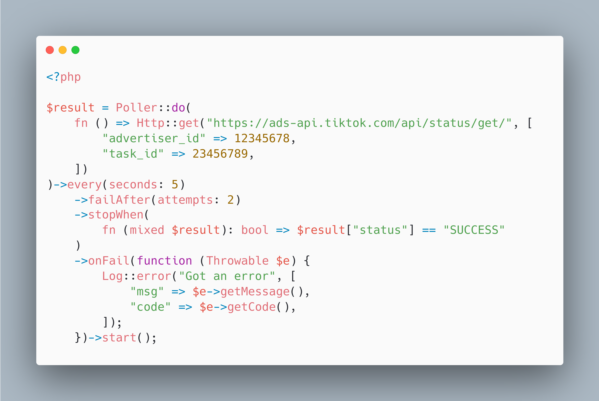

# PHP Poller

[](https://packagist.org/packages/mosamirzz/poller)
[](https://packagist.org/packages/mosamirzz/poller)




A very simple way to do a Polling mechanism using PHP.

## Installation

You can install the package via composer:

```bash
composer require mosamirzz/poller
```

## Usage

```php
$result = Poller::do(
    fn () => Http::get("https://ads-api.tiktok.com/api/status/get/", [
        "advertiser_id" => 12345678,
        "task_id" => 23456789,
    ])
)->every(seconds: 5)
    ->failAfter(attempts: 3)
    ->stopWhen(
        fn (mixed $result): bool => $result["status"] == "SUCCESS"
    )
    ->onFail(function (Throwable $e) {
        Log::error("Got an error", [
            "msg" => $e->getMessage(),
            "code" => $e->getCode(),
        ]);
    })
    ->start();
```

### Testing

```bash
composer test
```

### Changelog

Please see [CHANGELOG](CHANGELOG.md) for more information what has changed recently.

## Contributing

Please see [CONTRIBUTING](CONTRIBUTING.md) for details.

### Security

If you discover any security related issues, please email gm.mohamedsamir@gmail.com instead of using the issue tracker.

## Credits

-   [Mohamed Samir](https://github.com/poller)
-   [All Contributors](../../contributors)

## License

The MIT License (MIT). Please see [License File](LICENSE.md) for more information.

## PHP Package Boilerplate

This package was generated using the [PHP Package Boilerplate](https://laravelpackageboilerplate.com) by [Beyond Code](http://beyondco.de/).
